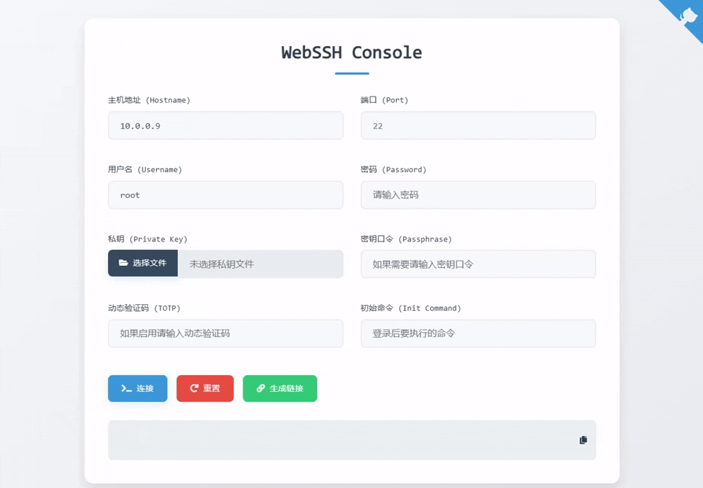

# WebSSH


为你的SSH连接需求提供安全便捷的管理方案

## ✨ 项目简介
WebSSH 是一个基于 Web 的轻量级 SSH 管理工具，方便地在浏览器中进行安全的远程服务器管理。

## 🚀 一键云部署
[](https://template.run.claw.cloud/?openapp=system-fastdeploy%3FtemplateName%3Dwebssh)
[](https://app.koyeb.com/deploy?type=docker&name=webssh&ports=8888;http;/&image=docker.io/cmliu/webssh)
## 🐳 Docker 一键部署
```shell
docker run -d --name webssh --restart always -p 8888:8888 cmliu/webssh:latest
```

## ⚙️ Docker `compose.yml` 部署
```yml
version: '3'
services:
  webssh:
    container_name: webssh
    image: cmliu/webssh:latest
    ports:
    - "8888:8888"
    restart: always
    network_mode: bridge
```

## 🏗️ 手动部署
在克隆代码后，通过安装依赖并运行脚本即可快速启动项目：

```shell
git clone https://github.com/cmliu/webssh
cd webssh
pip install -r requirements.txt && python run.py --delay=10 --encoding=utf-8 --fbidhttp=False --maxconn=20 --origin='*' --policy=warning --redirect=False --timeout=10 --port=8888 --debug --xsrf=False --xheaders --wpintvl=1
```

## 💡 工作原理
WebSSH 通过 WebSocket 与浏览器进行实时交互，并将请求转发给基于 Tornado 与 Paramiko 的后端，实现对 SSH 服务器的安全连接和交互。流程如下所示：
```
+---------+     http     +--------+    ssh    +-----------+
| browser | <==========> | webssh | <=======> | ssh server|
+---------+   websocket  +--------+    ssh    +-----------+
```
这使得用户无需本地安装 SSH 客户端，即可通过网页方便快速地完成服务器管理操作。

## 🛠️ 更多资料
- [部署到容器的教程](https://zelikk.blogspot.com/2023/10/huashengdun-webssh-codesandbox.html)
- [部署到Hugging Face的教程 / 作者 Xiang xjfkkk](https://linux.do/t/topic/135264)
- [部署到 Serv00 教程 / 作者 Xiang xjfkkk](https://linux.do/t/topic/211113)

# 🙏 致谢
[huashengdun](https://github.com/huashengdun/webssh)、[crazypeace](https://github.com/crazypeace/huashengdun-webssh)、[Mingyu](https://github.com/ymyuuu)、[ClawCloud](https://console.run.claw.cloud/signin?link=1DFUAGF6JA6R)